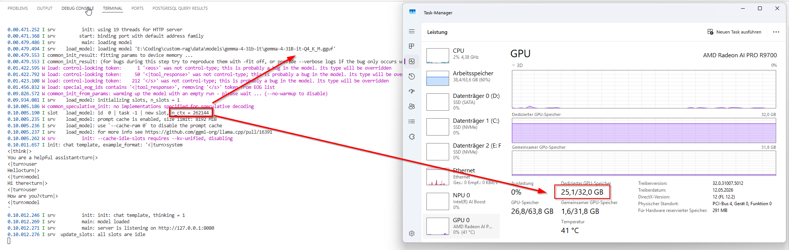
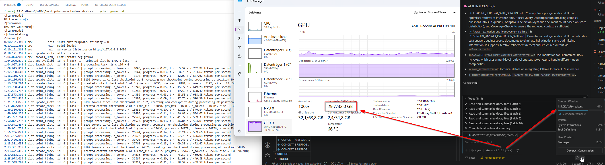

# Gemma-4 31B at 256K Context on a $1,400 AMD GPU — TurboQuant KV Cache on RDNA4


> The first working setup that runs **Gemma-4-31B-it with a TurboQuant KV cache *and* HIP graphs
> together on AMD RDNA4** (gfx1201) — **735 tok/s prefill, crash-free decode**, and the model's
> **full 256K native context loaded** on a single **$1,400 Radeon AI PRO R9700** (32 GB) with
> ~9 GB to spare. Every number here was measured on real hardware; nothing is extrapolated.

<p align="center">
  
  <br>
  <em>Gemma-4-31B-it at its full <strong>256K context</strong> (<code>n_ctx = 262144</code>) on a single AMD Radeon AI PRO R9700 — model loaded and responding, ~25&nbsp;GB of 32&nbsp;GB dedicated VRAM in use. (turbo3/turbo3 load-only is lighter at ~22.9&nbsp;GB; see <a href="docs/BENCHMARKS.md">BENCHMARKS.md</a>.)</em>
</p>

**Two things, kept separate and honest:**

1. **A fix (new).** A small HIP-graph-safe Flash-Attention patch makes TurboQuant's quantized
   KV cache coexist with HIP graphs on RDNA4 — fast TILE prefill (**735 tok/s**) *and* crash-free
   VEC decode. Out of the box, turbo KV + `GGML_HIP_GRAPHS=ON` crashes on the first decode step.
2. **A measured study.** The full **256K** context *loads and runs* on a 32 GB card, and three
   llama.cpp/llama-server defaults (`-b 16384`, `--parallel 4`, and the server's session-state
   defaults) silently cost **5–10× decode**. (256K *loading* itself is a turbo3 + Gemma-SWA +
   small-batch result — **not** caused by the patch.)

Everything here was measured on real hardware; nothing is extrapolated.

---

## TL;DR

| What | Result |
|------|--------|
| **Model** | Gemma-4-31B-it Q4_K_M (17.05 GiB, 30.7 B params, hybrid SWA) |
| **GPU** | AMD Radeon AI PRO R9700 (gfx1201, RDNA4, 32 GB) — a ~$1,400 card |
| **Max context loaded** | **256K** (full native), ~22.9 GB VRAM, ~9 GB free |
| **Prefill (pp2048)** | **735 tok/s** — turbo4 KV + HIP graphs, no crash |
| **Decode** | **~22 tok/s** at low context → **9.4 tok/s at 128K** (turbo3, llama-bench) — vs ~1.3 if you hit the `-b 16384` / `--parallel 4` traps |
| **Quality (needle @ 8K–33K)** | `q8_0/turbo4` **9/9**, `turbo3/turbo3` **9/9** |

---

## Does this apply to you?

| You have… | What's in it for you |
|-----------|----------------------|
| **AMD RDNA4** (R9700, RX 9070 / 9070 XT, gfx1201) on Windows + ROCm | ✅ **Directly** — tested config + one-command build |
| Other AMD ROCm GPU (RDNA3, gfx110x) | ⚠️ Patches likely apply; build flags differ (untested here) |
| NVIDIA / CUDA | ⚙️ The HIP patch isn't for you, but the **three config-trap findings below apply to any GPU** |
| **Any llama.cpp long-context user** | ✅ Three defaults (`-b 16384`, `--parallel 4`, server session state) can quietly cost you **5–10× decode** — see [docs/BENCHMARKS.md](docs/BENCHMARKS.md) |
| **VS Code Copilot user** | ✅ [docs/VSCODE-COPILOT.md](docs/VSCODE-COPILOT.md) wires this into Copilot Chat as a local model — real **176K-token agent session** documented |

Three findings drive the whole story:

1. **The "VRAM wall at 128K" was a batch-buffer artifact, not a hardware/KV limit.** A
   `-b 16384` Flash-Attention scratch buffer (~1.8 GB) spilled turbo4 over the 32 GB edge.
   Dropping to `-b 2048 -ub 512` recovers **5.2x** decode at 128K *with no quality loss* —
   and lets the model load the **full 256K context** with ~9 GB to spare.
2. **TurboQuant + HIP graphs needed a fix.** Out of the box, `turbo4` KV crashes the moment
   HIP graph capture is enabled (`operation not permitted when stream is capturing`). Two
   small patches (`patches/0001-…`) make Flash-Attention graph-capture-safe on decode while
   keeping the fast TILE kernel for prefill.
3. **llama-server's session-state defaults are a third silent trap for SWA models.** At 256K,
   32 context checkpoints (~7.3 GB) plus an 8 GB prompt cache pushed **13.8 GB into shared
   GPU memory** during a real 176K VS Code session and collapsed decode to 0.85 tok/s.
   `--ctx-checkpoints 4 --cache-ram 0` recovered ~2.6× — see [docs/VSCODE-COPILOT.md](docs/VSCODE-COPILOT.md).

---

## The Story

The goal: run Gemma-4-31B-it at its full 256K context on an AMD Radeon AI PRO R9700
(gfx1201, RDNA4, 32 GB) for agentic coding — where long context actually matters.

Three obstacles stood in the way, and each turned out to be a *configuration or integration*
problem rather than a hardware limit:

### 1. TurboQuant KV crashed under HIP graphs

TheTom's [`llama-cpp-turboquant`](https://github.com/TheTom/llama-cpp-turboquant) fork adds
3-bit/4-bit TurboQuant KV cache to llama.cpp. On AMD HIP it had two coupled problems:

- **Slow prefill:** the fork forced the **VEC** Flash-Attention kernel for *all* quantized
  KV, which processes queries sequentially — fine for decode, slow for large prefill batches
  (~188 tok/s).
- **Decode crash:** the f16 dequant temp buffer used raw `cudaMalloc`/`cudaFree`/
  `cudaStreamSynchronize`, which are **forbidden during HIP graph capture**. With
  `GGML_HIP_GRAPHS=ON`, turbo4 decode crashed instantly.

**The fix** (`patches/0001-turbo4-hip-graph-safe-fattn.patch`, submitted upstream as
[TheTom/llama-cpp-turboquant#176](https://github.com/TheTom/llama-cpp-turboquant/pull/176)):

- Route **small decode batches** (`Q->ne[1] <= 8`) through the VEC kernel *and* the memory
  pool, so capture sees no raw allocations — graph-safe.
- Let **large prefill batches** fall through to the fast TILE/MMA kernel and allocate their
  temp buffer eagerly (not captured), so prefill stays ~3.4x faster.

Result: **735 tok/s prefill + turbo4 KV + HIP graphs, no crash** — beating both the
no-graphs fallback (188 tok/s) and the non-turbo baseline.

### 2. The "128K VRAM wall" was a `-b 16384` batch buffer

Our first turbo4 context sweep showed decode collapsing at 128K to **1.28 tok/s** — and
earlier we blamed VRAM. A fast load-only VRAM measurement (read GPU process memory counters
right after the model loads) told a different story:

| Config @ 128K, idle | Batch | Dedicated VRAM | Spill (shared) |
|---------------------|-------|----------------|----------------|
| turbo3/turbo3 | 2048 | 20.61 GB | 0.30 GB |
| turbo4/turbo4 | 2048 | 21.56 GB | 0.30 GB |
| turbo4/turbo4 | **16384** | **23.40 GB** | **1.15 GB ⚠️** |

The KV difference between turbo3 and turbo4 is only ~1 GB (both tiny thanks to Gemma's SWA).
The **`-b 16384` scratch buffer costs ~1.8 GB** and spills turbo4 over the 32 GB edge *while
idle* — so a full-cache decode collapses to 1.28 tok/s. The fix is one flag:

| @ 128K decode | tok/s | |
|---------------|-------|---|
| turbo4/turbo4, `-b 16384` | 1.28 | ❌ spill |
| q8_0/turbo4, `-b 16384` | 1.16 | ❌ spill |
| **turbo4/turbo4, `-b 2048`** | **6.63** | ✅ **+5.2x — pure batch fix** |
| turbo3/turbo3, `-b 16384` | 9.75 | ✅ smaller KV, fits |
| **turbo3/turbo3, `-b 2048`** | **9.38 ± 0.93 tok/s** (llama-bench) | ✅ **best decode, recommended** |

### 3. Full 256K really fits — with `--parallel 1`

A second hidden trap: llama-server defaults to `--parallel 4` (auto). With 4 active KV cache
slots at 256K context each, the combined KV overflows VRAM into CPU RAM (PCIe bandwidth).
The decode speed collapse is dramatic:

| Config | True context | `--parallel` | Decode |
|--------|-------------|-------------|--------|
| turbo3/b=2048 | ~170K (est., no tokenizer) | 4 (auto) | 1.34 tok/s ❌ KV swapped to RAM |
| turbo3/b=2048 | **128K (llama-bench)** | 1 | **9.38 ± 0.93 tok/s** ✅ most reliable |
| turbo3/b=2048 | ~170K (server log confirmed) | 1 | 2.52 tok/s |
| turbo3/b=2048 | ~131K (server log, cache restore) | 1 | 3.18 tok/s |

> **Note:** the `/tokenize` endpoint returns 404 on this build, so live-server context depth is estimated from filler generation.
> The 256K slot **loads cleanly** at 22.88 GB (~9 GB free). The 9.38 tok/s llama-bench figure is the most controlled measurement.

**Always set `--parallel 1`** for single-user long-context inference on a 32 GB card.

With `--parallel 1 -b 2048 -ub 512`, the model loads its entire native context with room to spare:

| Context | Dedicated VRAM | Spill | Free (of 32 GB) |
|---------|----------------|-------|-----------------|
| 128K | 20.61 GB | 0.30 GB | ~11 GB |
| 160K | 21.13 GB | 0.36 GB | ~11 GB |
| 192K | 21.71 GB | 0.43 GB | ~10 GB |
| 224K | 22.29 GB | 0.49 GB | ~10 GB |
| **256K** | **22.88 GB** | 0.55 GB | **~9 GB** |

KV grows only ~0.58 GB per 32K of context because 5 of every 6 Gemma layers cap attention
at a 1024-token window. (This matches the [RTX 5090 report](https://www.reddit.com/r/LocalLLaMA/comments/1sbdihw/)
of Gemma-4-31B @ 256K — we even use slightly less VRAM: 22.9 vs 27.7 GB.)

---

## Quality: is the compressed KV actually good?

We validated two ways. **The short answer: `q8_0/turbo4` is the safe high-fidelity default,
and `turbo3/turbo3` is lossless for long-context retrieval despite a scary short-context
KLD number.**

### KL-divergence vs the f16 baseline (`-c 512`, wikitext-2, 20 chunks)

| Config (K/V) | Median KLD | Same-top-p | Verdict |
|--------------|-----------|------------|---------|
| f16 / f16 | 0 (ref) | 100% | baseline |
| q8_0 / q8_0 | 0.0147 | 87.2% | excellent |
| **q8_0 / turbo4** | 0.0996 | **76.5%** | **recommended** |
| turbo4 / turbo4 | 0.1338 | 74.3% | good |
| q8_0 / turbo3 | 1.8676 | 47.5% | drifts at short ctx |
| turbo3 / turbo3 | 3.0985 | 41.0% | drifts at short ctx |

> ⚠️ **`-c 512` is the wrong regime to judge turbo3.** Gemma's SWA window is 1024 tokens, so
> at 512 tokens *every* layer attends densely and we never exercise the long-context KV path
> that quantization targets. KLD@512 is a strict *stress* metric, not a verdict.

### Needle-in-a-haystack (Google's methodology, 8K–33K context)

Embed a unique fact at depth *d* in *N* tokens of filler, then ask the model to retrieve it.
3 context sizes × 3 depths = 9 cells per config:

| Config | 8K | 16K | 33K | Score |
|--------|----|----|----|-------|
| q8_0 / turbo4 | ✅✅✅ | ✅✅✅ | ✅✅✅ | **9/9** |
| turbo3 / turbo3 | ✅✅✅ | ✅✅✅ | ✅✅✅ | **9/9** |

**`turbo3` retrieves perfectly at long context despite its 41% KLD@512** — confirming
Google's "3-bit, near-zero loss" claim for *retrieval*. Honest caveat: single-fact retrieval
is an easy probe; harder multi-hop or exact-reproduction tasks may still benefit from
turbo4's higher per-token fidelity. See [docs/QUALITY.md](docs/QUALITY.md) and
[benchmarks/results/needle-longcontext.md](benchmarks/results/needle-longcontext.md).

---

## Recommended configuration

```bash
llama-server \
    -m gemma-4-31B-it-Q4_K_M.gguf \
    --alias "Gemma-4-31B-it" \
    --ctx-size 131072 \        # 128K for agentic coding; bump to 262144 for full 256K
    --batch-size 2048 \        # CRITICAL: NOT 16384 — large batch spills VRAM at long ctx
    --ubatch-size 512 \
    --flash-attn on \
    --cache-type-k q8_0 \      # 8-bit keys: protect attention routing (softmax is K-sensitive)
    --cache-type-v turbo4 \    # ~4.25-bit values: highest-fidelity TurboQuant level
    --parallel 1 \             # CRITICAL: --parallel 4 default swaps KV to CPU RAM at long ctx (measured 1.3 vs 9.4 t/s at 128K)
    --jinja \
    --reasoning-format auto    # Gemma-4 is a thinking model — clients must read reasoning_content
```

| Goal | K / V | Batch | Why |
|------|-------|-------|-----|
| **Best fidelity (default)** | `q8_0` / `turbo4` | `-b 2048` | Max quality, needle 9/9, 6.63 t/s @128K, loads to 256K |
| **Max context + speed** | `turbo3` / `turbo3` | `-b 2048` | 256K + fastest decode; lossless for retrieval, higher per-token drift |

> **Note:** `turbo3/turbo3` runs fine on this RDNA4 card (gfx1201) — no NaNs in any of our
> KLD or needle runs. Earlier community reports of "turbo3 NaN on AMD" did not reproduce here.

---

## Quick start

```powershell
# 1. Build TheTom's fork with the RDNA4/Windows patches applied
.\scripts\setup.ps1            # clones, patches, and builds for gfx1201 (see below)

# 2. Verify TurboQuant + SWA + graphs are active
.\scripts\verify_turboquant.ps1

# 3. Run a long-context needle test against a running server
python benchmarks\needle_test.py --base-url http://127.0.0.1:8080/v1 --label q8_0-turbo4
```

Want it inside your editor? [docs/VSCODE-COPILOT.md](docs/VSCODE-COPILOT.md) plugs the server
into **VS Code GitHub Copilot Chat** as a local custom model — including a documented real
176K-token agent session and the server flags that make it survivable.

<p align="center">
  
  <br>
  <em>A real Copilot agent session at ~176K tokens of context, fully local on the R9700 —
  server timings, GPU memory, and the chat answering, in one frame.</em>
</p>

The single-command [`scripts/setup.ps1`](scripts/setup.ps1) clones
[`TheTom/llama-cpp-turboquant`](https://github.com/TheTom/llama-cpp-turboquant) at the tested
commit, applies both patches in `patches/`, and builds for `gfx1201` with HIP graphs.
Full manual steps and all Windows/HIP gotchas are in
[docs/BUILD-WINDOWS-HIP.md](docs/BUILD-WINDOWS-HIP.md).

---

## Repository layout

```
gemma4-turboquant-rdna4/
├── README.md                       # This file
├── patches/
│   ├── 0001-turbo4-hip-graph-safe-fattn.patch   # The hero: HIP-graph-safe FA for turbo KV
│   └── 0002-windows-hip-build-fixes.patch       # peer-memcpy + cudaEventCreate for Windows HIP
├── scripts/
│   ├── setup.ps1                   # Single-command clone + patch + build
│   ├── build_turboquant.ps1        # Build only
│   ├── verify_turboquant.ps1       # Check binary / config / KV / speed
│   └── verify_swa.ps1              # Check Gemma SWA pattern parsing
├── configs/
│   └── run_gemma4.ps1             # Self-contained llama-server launcher (recommended config)
├── benchmarks/
│   ├── needle_test.py              # Long-context retrieval harness (stdlib only)
│   ├── api_benchmark.py            # Streaming API benchmark
│   └── results/                    # All measured JSON + markdown results
├── assets/                         # Measured-evidence screenshots (256K load, 176K session)
└── docs/
    ├── BUILD-WINDOWS-HIP.md        # Full tested build guide
    ├── HIP-GRAPH-FIX.md            # Technical deep-dive on the two patches
    ├── BENCHMARKS.md               # Full measured numbers + methodology
    ├── VSCODE-COPILOT.md           # Local model in VS Code Copilot Chat (176K session)
    ├── QUALITY.md                  # KLD + needle quality study
    ├── CONFIG-GEMMA4.md            # Config reference
    ├── SWA-BUG.md                  # Gemma-4 hybrid-SWA parsing bug (fixed in the fork)
    ├── VERIFY-TURBOQUANT.md        # How to confirm TurboQuant is active
    └── UPSTREAM-PR-NOTES.md        # PR notes (TheTom's fork)
```

---

## Hardware & build

| Component | Specification |
|-----------|--------------|
| GPU | AMD Radeon AI PRO R9700 (gfx1201, RDNA4, 32,624 MiB) |
| CPU | Intel Core Ultra 7 265KF (20 threads) |
| OS | Windows 11 |
| HIP SDK | 7.1, Clang 21 |
| Source | [TheTom/llama-cpp-turboquant](https://github.com/TheTom/llama-cpp-turboquant) @ `7d9715f` |
| Build flags | `-DGGML_HIP=ON -DGGML_HIP_GRAPHS=ON -DGGML_CUDA_FA_ALL_QUANTS=ON`, Ninja, Release |

---

## Key takeaways

1. **The 128K decode collapse was a `-b 16384` Flash-Attention scratch-buffer spill**, not a
   KV, SWA, or quantization problem. `-b 2048 -ub 512` recovers 5.2x and unlocks full 256K.
2. **TurboQuant KV and HIP graphs can coexist on RDNA4** with a small graph-capture-aware
   Flash-Attention fix (`patches/0001`) — submitted upstream as
   [TheTom/llama-cpp-turboquant#176](https://github.com/TheTom/llama-cpp-turboquant/pull/176).
3. **`q8_0/turbo4` is the safe default** (needle 9/9, KLD same-top 76.5%); **`turbo3/turbo3`
   is lossless for long-context retrieval** (needle 9/9) despite a poor KLD@512 — KLD@512 is
   the wrong regime, not a turbo3 verdict.
4. **A $1,400 RDNA4 card runs a 31B dense model at full 256K context** with ~9 GB to spare.

---

## References

- [TurboQuant paper (ICLR 2026)](https://arxiv.org/abs/2504.19874)
- [TheTom/llama-cpp-turboquant](https://github.com/TheTom/llama-cpp-turboquant) — llama.cpp fork with TurboQuant KV cache
- [Reddit: Gemma-4 31B at 256K on RTX 5090](https://www.reddit.com/r/LocalLLaMA/comments/1sbdihw/) — cross-hardware reference
- [llama.cpp Gemma-4 SWA discussion](https://github.com/ggml-org/llama.cpp/issues/21394)

## Credits

This work stands on three shoulders:

- **[TheTom/llama-cpp-turboquant](https://github.com/TheTom/llama-cpp-turboquant)** — the
  llama.cpp fork that brought the TurboQuant+ codec stack to llama.cpp in the first place.
  Our patches target this fork (PR [#176](https://github.com/TheTom/llama-cpp-turboquant/pull/176));
  this repo documents and measures, the fork does the heavy lifting.
- **[TurboQuant](https://arxiv.org/abs/2504.19874)** (Google Research, ICLR 2026) — the
  underlying KV-cache quantization method (random rotation + QJL error correction).
- **[llama.cpp / ggml](https://github.com/ggml-org/llama.cpp)** — the foundation everything
  runs on.

## License

This repository (docs, scripts, patches) is released under the [MIT License](LICENSE).
Upstream components keep their own licenses: llama.cpp is MIT, TurboQuant is Apache 2.0.
