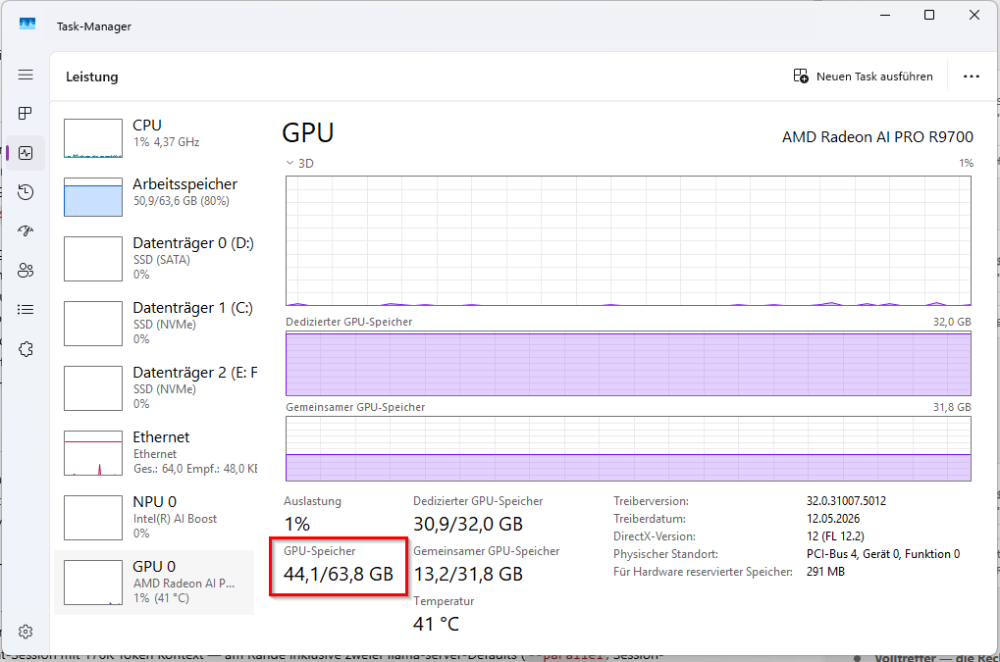

# Benchmark Results

All results are for **Gemma-4-31B-it Q4_K_M** (17.05 GiB, 30.7 B params) on an
**AMD Radeon AI PRO R9700** (gfx1201, RDNA4, 32 GB VRAM). Every number below was measured on
this hardware; nothing is extrapolated.

## Hardware & Software

| Component | Specification |
|-----------|--------------|
| GPU | AMD Radeon AI PRO R9700 (gfx1201, RDNA4, 32,624 MiB) |
| CPU | Intel Core Ultra 7 265KF (20 threads) |
| OS | Windows 11 |
| HIP SDK | 7.1, Clang 21 |
| Build | TheTom/llama-cpp-turboquant `7d9715f` + patches in `patches/` (HIP graphs ON) |
| Flash Attention | ON |

---

## 1. Throughput: turbo4 KV + HIP graphs

`llama-bench`, build `bTurboQuant-gfx1201-turbo4-graphs` (HIP_GRAPHS=ON), turbo4/turbo4:

| Test | Prefill | Decode | Note |
|------|---------|--------|------|
| `pp2048 / tg128` | **735.7 t/s** | **22.9 t/s** | turbo4 KV + HIP graphs, no crash, exit 0 |
| interactive CLI | 522.7 t/s | 24.1 t/s | coherent output, no crash |

This beats both the non-turbo jagsan baseline (641 t/s prefill, no turbo4) and the
no-graphs turbo4 fallback (188 t/s prefill) — see [HIP-GRAPH-FIX.md](HIP-GRAPH-FIX.md).

---

## 2. Context sweep (turbo4/turbo4, `-b 16384`)

`llama-bench`, prefill = `-p N -n 0`, decode = `-d N -p 0 -n 128`:

| Context | Prefill (t/s) | Decode (t/s) |
|---------|---------------|--------------|
| 2K | 810.85 ± 2.13 | 21.70 ± 2.24 |
| 4K | 712.56 ± 1.32 | 21.51 ± 1.85 |
| 8K | 652.32 ± 1.32 | 19.99 ± 0.52 |
| 16K | 566.04 ± 0.81 | 19.09 ± 0.90 |
| 32K | 461.42 ± 1.11 | 16.18 ± 0.76 |
| 64K | 335.58 ± 0.75 | 13.82 ± 1.12 |
| 128K | 207.74 ± 1.10 | **⚠️ 1.28 ± 0.00** |

The 128K decode collapse looked like a VRAM wall — but it is a **batch-buffer artifact**, see below.

---

## 3. The batch-buffer fix (the key result)

### VRAM at 128K, idle (load-only measurement)

| Config | Batch | Dedicated VRAM | Spill (shared) |
|--------|-------|----------------|----------------|
| turbo3/turbo3 | 2048 | 20.61 GB | 0.30 GB |
| turbo4/turbo4 | 2048 | 21.56 GB | 0.30 GB |
| turbo4/turbo4 | **16384** | **23.40 GB** | **1.15 GB ⚠️** |

The `-b 16384` Flash-Attention scratch buffer adds ~1.8 GB and spills turbo4 over the 32 GB
edge while idle. The KV difference between turbo3 and turbo4 is only ~1 GB.

### Decode @ 128K — batch is the lever

| Config | Batch | Decode t/s | |
|--------|-------|-----------|---|
| turbo4/turbo4 | 16384 | 1.28 | ❌ spill |
| q8_0/turbo4 | 16384 | 1.16 | ❌ spill |
| **turbo4/turbo4** | **2048** | **6.63** | ✅ **+5.2x — pure batch fix** |
| turbo3/turbo3 | 16384 | 9.75 | faster (smaller KV), see QUALITY.md |
| **turbo3/turbo3** | **2048** | **9.38 ± 0.93** | ✅ **recommended — best decode (llama-bench, source of truth)** |

**Dropping `-b 16384` → `-b 2048` alone recovers 5.2x decode at 128K with no quality change.**
The recommended `turbo3/turbo3 -b 2048` config sustains **9.38 ± 0.93 t/s at 128K** (llama-bench
`tg128 @ d131072`, `-r 1`) — this is the most controlled long-context decode figure we have.

### The session-state trap: llama-server defaults (SWA models)

Found during a real 176K-token VS Code Copilot session (live-session measurements, not
llama-bench): decode collapsed progressively from 2.11 t/s (@ ~107K fill) to **0.85 t/s**
(@ ~187K), with **13.8 GB in shared GPU memory** on top of 29/32 GB dedicated. The culprit
was llama-server's per-session state, which at 256K ctx with an SWA model is huge by default:

| Server feature | Default | Cost @ 256K (Gemma-4-31B) | Fix |
|----------------|---------|---------------------------|-----|
| SWA context checkpoints | 32/slot | 32 × 234 MiB ≈ **7.3 GB** | `--ctx-checkpoints 4` |
| Prompt cache | 8192 MiB | up to **8 GB** | `--cache-ram 0` |

With both caps, shared-memory spill dropped **13.8 → 1.35 GB** and live decode at ~176K
recovered ~2.6× (0.85 → ~2.3 t/s). An A/B test of `--no-kv-unified` at the same depth
*halved* decode (2.26 → 1.24 t/s) — keep `--kv-unified` enabled. Full setup + screenshots:
[VSCODE-COPILOT.md](VSCODE-COPILOT.md).

---

## 4. Loading the full 256K context

turbo3/turbo3, `-b 2048 -ub 512`, load-only:

| Context | Status | Dedicated VRAM | Spill | Free (of 32 GB) |
|---------|--------|----------------|-------|-----------------|
| 128K | ✅ | 20.61 GB | 0.30 GB | ~11 GB |
| 160K | ✅ | 21.13 GB | 0.36 GB | ~11 GB |
| 192K | ✅ | 21.71 GB | 0.43 GB | ~10 GB |
| 224K | ✅ | 22.29 GB | 0.49 GB | ~10 GB |
| **256K** | ✅ | **22.88 GB** | 0.55 GB | **~9 GB** |

KV grows only ~0.58 GB per 32K — Gemma's SWA caps 5 of every 6 layers at a 1024-token window.

### The f16 baseline — measured, not calculated

What does the *unquantized* KV cache cost at the same context sizes? We loaded it (same
load-only method, `-b 2048 -ub 512 --parallel 1 -fa on`, no cache-type flags = f16/f16):

| Config | Context | Dedicated (process) | Spill to system RAM | Verdict |
|--------|---------|--------------------:|--------------------:|---------|
| f16/f16 | 131072 | 27.41 GB | **2.03 GB** | already spilling while idle |
| f16/f16 | 262144 | 27.81 GB | **12.24 GB** | ~40 GB demand — far beyond the card |
| q8_0/q8_0 | 262144 | 29.50 GB | 0.60 GB | loads, but very tight (load-only, 2026-06-17) |
| q4_0/q4_0 | 262144 | 24.19 GB | 0.60 GB | loads (load-only, 2026-06-17) |
| turbo3/turbo3 | 262144 | 22.88 GB | 0.55 GB | ✅ fits, ~9 GB free |

System-wide, Task Manager showed **44.1 GB total GPU memory demand** for f16 at 256K
(30.9/32.0 GB dedicated + 13.2 GB shared):

  
   
  <em>f16/f16 at 256K: 44.1 GB total GPU memory on a 32 GB card — 13.2 GB silently swapped to
  system RAM. The TurboQuant cache is the measured difference between this and ~9 GB of headroom.</em>

> **Decode at 256K was not benchmarked.** The 256K figures above are **load-only** (VRAM
> after model load). A steady-state 256K decode run requires a full 256K prefill, which we did
> not capture. The reliable long-context decode reference remains **9.38 ± 0.93 t/s at 128K**
> (turbo3/turbo3, `-b 2048`, llama-bench). 256K is demonstrated here to *load and run* with
> ~9 GB free — not measured for steady decode throughput.
>
> **q8_0/q4_0 load-only (2026-06-17):** q8_0/q8_0 needs 29.5 GB and q4_0/q4_0 24.2 GB at 256K idle.
> Both load, but with less headroom than turbo3 they spill earlier once the context actually fills —
> the comfortable working zone stays at 128K (see §3). Loading is not the same as running a full context.

---

## 5. Quality

See [QUALITY.md](QUALITY.md) for the full KL-divergence and needle-in-a-haystack study.
Summary: `q8_0/turbo4` needle 9/9 (recommended), `turbo3/turbo3` needle 9/9 (max context).

---

## Historical baseline (jagsan-cyber fork, broken SWA, q4_0/q4_0)

This is the *starting point* before TheTom's fork and our patches. It used a different fork
with a Gemma-4 SWA-pattern parsing bug (see [SWA-BUG.md](SWA-BUG.md)):

| Context | Prefill t/s | Decode t/s | Total |
|---------|-------------|-----------|-------|
| 16K | 545.5 | 20.4 | 38.1s |
| 32K | 765.2 | 16.4 | 52.8s |
| 64K | 481.0 | 3.7 | 177.0s |
| 128K | 289.8 | 1.4 | 588.5s |

> **Note on attribution.** The 1.4 t/s @128K here was originally blamed entirely on the SWA
> bug. Our later measurements show the 128K decode collapse persists even *with* the SWA fix
> when `-b 16384` is used (1.28 t/s) — so the dominant driver at 128K is the **batch-buffer
> spill**, not the SWA bug. The SWA fix matters for correctness and mid-context efficiency;
> the batch flag matters for the 128K cliff.

---

## Methodology

- **llama-bench**: temperature 0, deterministic; prefill `-p N -n 0`, decode `-d N -p 0 -n 128`.
- **VRAM (load-only)**: start `llama-server`, read `\GPU Process Memory(pid_*)\Dedicated Usage`
  and `Shared Usage` performance counters ~15 s after load. Fast and avoids full decode runs.
- **Needle**: `benchmarks/needle_test.py` against a running server (see QUALITY.md).
- **KLD**: `llama-perplexity --kl-divergence` vs a saved f16 baseline, wikitext-2, `-c 512`.

## 6. Dense model comparison: Qwen 3.6 27B

To understand when TurboQuant helps and when it hurts, we benchmarked a **dense** model
(Qwen 3.6 27B, all layers global attention, no SWA) on the same hardware. This is the
same GPU, same build, same methodology — only the model architecture differs.

**Model:** Qwen3.6-27B-Q4_K_M-mtp.gguf (15.65 GiB, 27.32B params, dense attention)
**Method:** llama-bench tg128, `-r 1`, `-b 2048 -ub 512`, flash-attn on

### Decode throughput by context depth

| Context | f16 (t/s) | turbo3 (t/s) | turbo4 (t/s) | turbo3 vs f16 |
|---------|-----------|--------------|---------------|----------------|
| d=0 | 26.11 | 26.83 | 26.48 | +2.8% |
| 4K | 27.62 | 25.52 | 25.36 | **−7.6%** |
| 32K | 24.08 | 19.48 | 21.47 | **−19.1%** |
| 128K | — | 13.47 | — | (f16 would spill) |

### 256K context loads with turbo3

| Context | Dedicated VRAM | Spill | Status |
|---------|---------------|-------|--------|
| 256K (turbo3) | 26.01 GB | 0.60 GB | ✅ fits |

> **Decode at 256K was not measured for Qwen.** The dense 256K prefill (O(n²), no SWA) is
> prohibitively long and the run was not captured. The deepest reliable Qwen decode point is
> **13.47 t/s at 128K** (turbo3). The row above confirms only that the cache *loads* in VRAM.

### Key insight: TurboQuant is NOT a universal speed boost

For **dense models at short/medium context**, TurboQuant is **slower** than f16:

- At 32K: turbo3 is 19% slower than f16 (19.48 vs 24.08 t/s)
- At 4K: turbo3 is 8% slower (25.52 vs 27.62 t/s)

The Walsh-Hadamard dequantization costs GPU cycles per token. When the KV cache fits
entirely in VRAM (which it does at ≤32K for all configs), compression saves no bandwidth
but adds dequant overhead → net slowdown.

**TurboQuant becomes valuable only when the KV cache would otherwise spill to CPU RAM.**
At 128K+, the compressed cache stays in VRAM while f16 would overflow → turbo3 enables
long-context operation that would otherwise be impossible or catastrophically slow.

### Why Gemma benefits more than Qwen

| Model | Architecture | turbo3 @128K | f16 @32K |
|-------|-------------|-------------|----------|
| Gemma-4-31B | Hybrid SWA (~10 global layers) | 9.38 ± 0.93 | ~22.9 |
| Qwen-3.6-27B | Dense (all global) | 13.47 | 24.08 |

Gemma's SWA means its KV cache grows slowly (only ~10/60 layers store full context),
so turbo3's bandwidth savings always outweigh the dequant cost. Qwen's dense attention
means the KV cache is large even at short context, but turbo3's compression ratio
doesn't help until the cache is large enough to cause bandwidth pressure.

**Practical recommendation for dense models:**
- **Short/medium context (<32K):** use f16 KV — faster AND higher quality
- **Long context (32K–256K+):** use turbo3 KV — avoids VRAM spill, enables otherwise impossible context lengths

---

## Result files

- `results/needle_results.jsonl` — raw needle test records (18, all passed)
- `results/needle-longcontext.md` — needle methodology + results
- `results/api_bench_b8192_broken_swa.json` — historical baseline (broken SWA, q4_0/q4_0)
